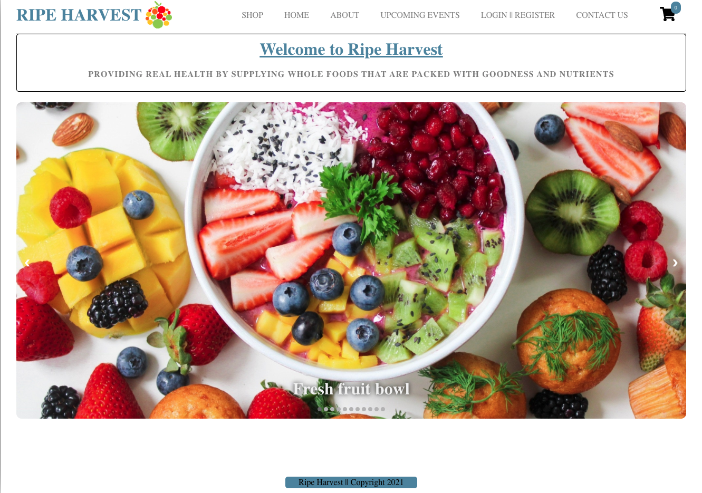
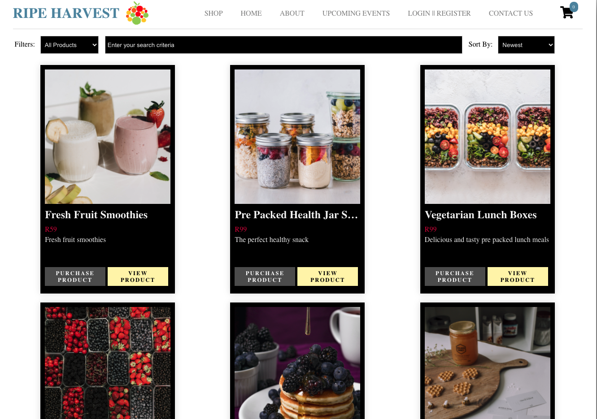
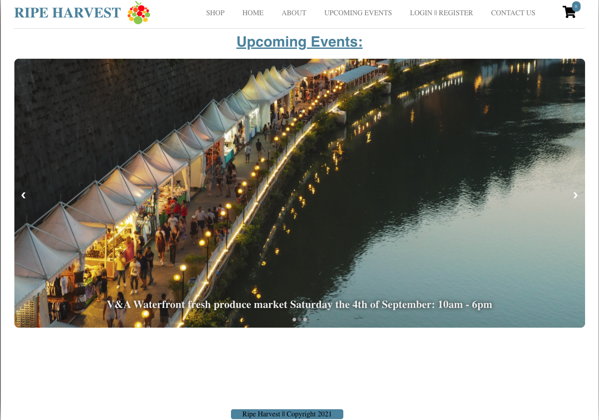
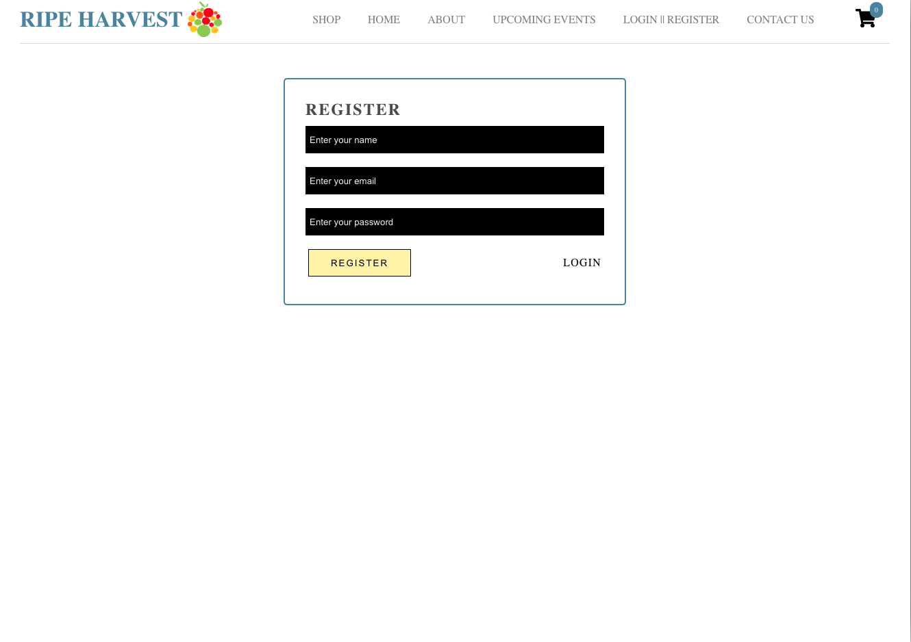
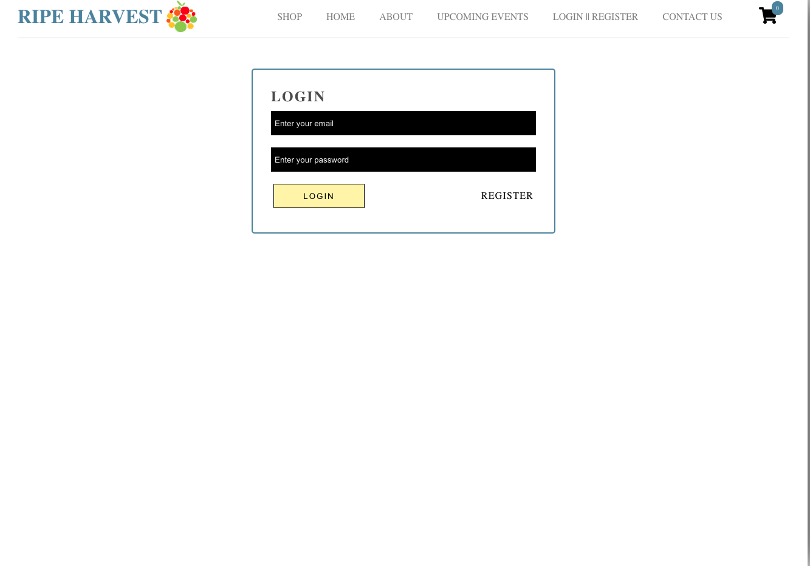
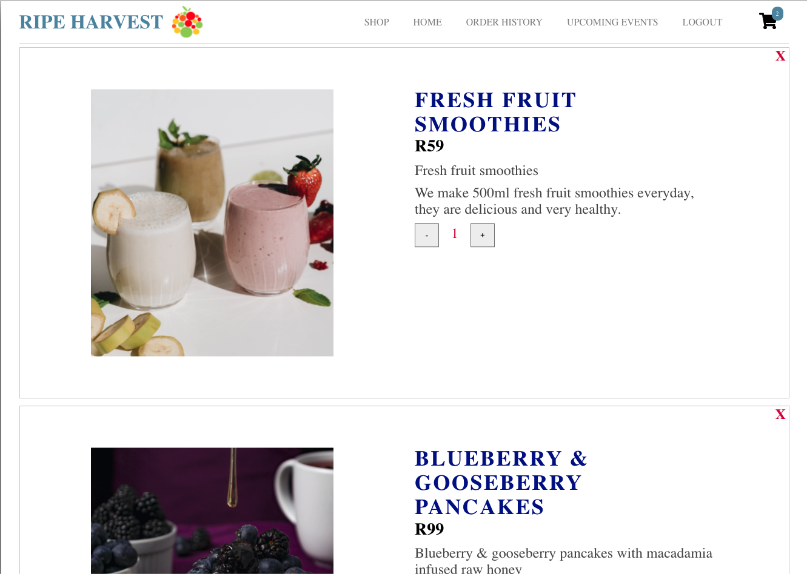

<a name="title"></a>

# Ripe Harvest E-commerce MERN

<a name="description"></a>

## Project description

This website is for a business owner that sells health products including raw honey, fresh berries, honey based butters,
creamed honey and more. The previous website that the owner had, didn't have all of the features that he wanted. The new website that I built has all of the features that the owner would like his business website to have which includes the ability to make purchase products online.

<a name="contents"></a>

# Table of contents

- [Project name](#title)
- [Project description](#description)
- [Table contents](#contents)
- [Installation](#installation)
- [Usage](#usage)
- [Api's](#apis)
- [Code tests](#tests)
- [Screenshots](#screenshots)
- [Software requirments](#software)
- [System architecture](#architecture)
- [System requirements](#system)
- [Functional requirements](#functional)
- [Non-functional requirements](#non-functional)
- [User stories](#user-stories)
- [Comparison](#comparison)

<a name="installation"></a>

# Installation

- You can install a copy of the site by cloning the GitHub repo, this can be done by running the following command:
  https://github.com/LukeG91/Ripe-Harvest-E-commerce-MERN.git

<a name="usage"></a>

# Usage

1. To install the necessary dependancies for the backend of the application, in the main project directory run: npm i
2. To install the necessary dependancies for the front-end of the application cd into the 'client' directory and run: npm i
3. From the main project directory run the following to start the application: npm run start-app
4. The above command will start up both the front end as well as the backend of the application
5. To test the site out as an end user, register using the registration page and then login to the website.
6. If you would like to test the payment system, please use the Paypal sandbox details below:

```
  Email: sb-rihzw7139114@personal.example.com
  Password: [a<-)8F3
```

7. If you would like to tst out the website as an Admin user, please use the details below:

```
  Email: admin@gmail.com
  Password: 123456
```

<a name="apis"></a>

## API's and API keys

I have used the cloudinary API service for media storage, I have also used a third party service called EmailJS for the sending of emails from the contact form and I have used PayPal for the checkout/payment process. All API keys that I have
used have been stored in a .env file and in turn these keys are not exposed and are therefore safe.

<a name="tests"></a>

## Unit and snapshot testing

I have written tests for both the front end as well as the backend of the application.

To run tests for the front-end of the application, do the following:

- cd client
- run 'npm test'

To run tests for the back-end of the application, do the following:

- cd into main project folder(Ripe-Harvest-E-Commerce)
- run 'npm test'

`The screenshots below display the different pages on the website and how to interact with the web page.`

<a name="screenshots"></a>

## ScreenshScrSots of the website

#### Home page



#### Shop page



#### Upcoming events page



#### Registration & login pages





#### Shopping cart



<a name="software"></a>

# Software Requirements Documentation

This document contains information relating to the software requirements for the Ripe Harvest website and it is made up of two main sections which are listed below:

- System Architecture
- System Requirements Specification

<a name="architecture"></a>

# System Architecture:

### **The software and web stack I will be using to build this application:**

I am going to be making use of the very popular MERN stack to build this application. The stack is made up of MongoDB, Express, React and Node.

### **Why I have chosen to use this web stack:**

I have chosen this stack as this is the web stack that I am planning to specialize in. With that being said, the vast majority of my experience with building applications has been using the JavaScript language, this fits perfectly into using the MERN stack to build an application as JavaScript is used for the front end code as well as for the backend code. My passion and route that I would like to follow is the e-commerce route using the MERN stack to build my applications, this is another reason why I have chosen to use this stack and on top of that I have built a few full stack applications using the MERN stack which gives me a good grounding and base on which to further my knowledge and understanding of the stack. The application I am going to be building is for a real customer that is a family member of mine who has a business that sells health products such as raw honey and fresh berries. I am going to build a site for their business as their current site is outdated and does not have the features that the owner of the business would like it to have. This build will be challenging but it is for a real client and a real business and it is in line with where I want to be working in my development career, another reason why I have chosen to use the MERN stack is because I am comfortable using the MERN stack and I think that this is a great opportunity for me to really sharpen the skills that I need to specialize in e-commerce web development as this is a more challenging build and it is a real world/usable project.

Some more technical reasons as to why I have chosen to use this stack is because there is a large amount of doumentation and support for developers using this stack. Another reason is that using the express framework I can create a server/API very quickly and I can also get a front end app up and running very quickly by using the React library and using (create-react-app) for the initial setup. All in all I think that the MERN stack allows developers to produce high quality, scalable and robust web applications and due to these technical reasons the MERN stack is my stack of choice for this website.

### **Application deployment:**

I am going to be deploying my application to the Heroku deployment platform. I will also be pointing the DNS away from the current/live site to this site once the owner is happy to retire the previous/original website. I am going to be making use of the Heroku deployment platform as it is a platform that I have used many times before so I know it well and I know how to resolve errors that often tend to pop up during deployment fairly quickly. I also know that Heroku is very serious about providing a good and secure platform for their customers which is very appealing to me since I am creating an e-commerce website.

### **Website look and feel:**

I am going to use CSS on it's own without any framework to style my application. I am also going to be making use of media queries to ensure that the website is responsive. I have chosen to go with plain CSS and no styling frameworks because this is what I know well and due to this reason I am choosing to stick with it, in addition, media queries are extremely useful and I want to get more experience with using them as being able to develop a responsive website is vitally important.

<a name="system"></a>

# System requirements specification

### **What is the purpose of this application and how will it work:**

This application is for a family member of mine who owns a business that sells health products such as different types of raw honey as well as fresh berries. He does have a website up at the moment but it is a very basic web site that was built a while ago and it doesn't have the functionaility that he would like it to have.
The purpose of this application is to give the business full ability to sell products and make money online. This application will have a user login and registration portal that users can use to login or sign-up. Once logged in, they will be able to view and add products to their shopping cart and will be able to make payment. Previous purchases will be available for users to see when logged into the user portal. The users will also have the ability to sort products based on specific criteria that will be available. I am going to be using the Cloudinary cloud storage service to store product images, I am going to store the URL to the images within the database.

The application will also have an admin portal where admin users will have the ability to see customer orders. Admin users will also be able to add, edit and delete products as well as product categories.

I am going to be making use of context for state management in React and I am going to be making use of paypal as the payment gateway.

### **Functional and Non-Functional Requirements**

<a name="functional"></a>

#### **Functional Requirements:**

1. This website will provide the ability for users to sign up and login to the application.
2. This website will allow users to purchase products using the paypal payment gateway.
3. This website will allow admin users to add, edit, view and delete products.
4. This website will allow admin users to add,edit view and delete product categories.
5. Admin users will be able to view customer order history.
6. Users will be able to view their purchase history.
7. Users will be able to filter products according to specific criteria.

<a name="non-functional"></a>

#### **Non-Functional Requirements:**

- **Performance**

  1. This website will inform users when a page is loading so that they know what is happening with the website when it is trying to pull/load information.
  2. I am going to ensure that the website is fully responsive in order for users on any device to have a good user experience.

- **Reliability**

  1. I am going to write tests for the front end as well as the backend of the application to ensure that the code does what it is meant to do.
  2. The Heroku platform is a very reliable platform/backbone for my application, I use the Heroku platform for many of my apps and I havn't experienced hosting/downtime or security issues, therefore this should mean that the site will be hosted on a good and stable platform.

- **Usability**

  1. My website will be user friendly and well layed out.
  2. I will keep consistent design methods across the different pages in the application.

- **Security**
  1. This website will make use of JWT technology to ensure user authorization.
  2. This website will make use of the bcrypt technology to hash user passwords so that they are not stored in plain text in the database
  3. I will add an SSL certificate to the domain when it is ready to go live. I plan to use the Let's Encrypt SSL certificate.

### **Who will use this website:**

This website will be used mostly by people who like to buy health products online and people who like to make use of e-commerce stores to buy food products.

<a name="user-stories"></a>

#### **User stories:**

1.  As a user I would like to be able to purchase the products I want online.
2.  As a user I want to be able to view my order history in my user portal.
3.  As a user I want to be able to filter products and show the newest products.
4.  As an admin user I want to be able to edit, view, update and delete products.
5.  As an admin user I want to be able to edit, view, update and delete product categories.
6.  As an admin user I want to be able to view the orders placed by customers.
7.  As a user I would like to see similar/related products when I click/view a specific product on the website.

<a name="comparison"></a>

#### **How does this website compare with other websites that provide a similar service and product:**

1. This website will be very well styled and it will be fully responsive giving it a very good look and feel across all devices which will ensure that the users like and use the website.

2. Compared to the exisitng website that he currently has, this one will be far ahead in terms of functionality and it will allow customers to purchase products online which is what the business owner wants the site to be able to do.

#### **Note**

- As mentioned above, this is a real world project for a real business, this has given me a great deal of experience so far as I have met with the business owner to understand exactly what they need their new website to be able to do in order to take their business to the next level. The meetings I have had with the business owner have been insightful and I have learnt alot from interacting with a real customer and learning how to present possible routes to follow as well as how to make design and system recommendations that will benefit the customer. I am just adding this note for context and I am really happy to be building a website that will be used to service many cusotmers from the Ripe Harvest business. In conclusion, this project has allowed me to really dive deep into doing research and I feel it will really help me take my full stack development skills to the next level as I am now building a website that is going to be used in the real world.
